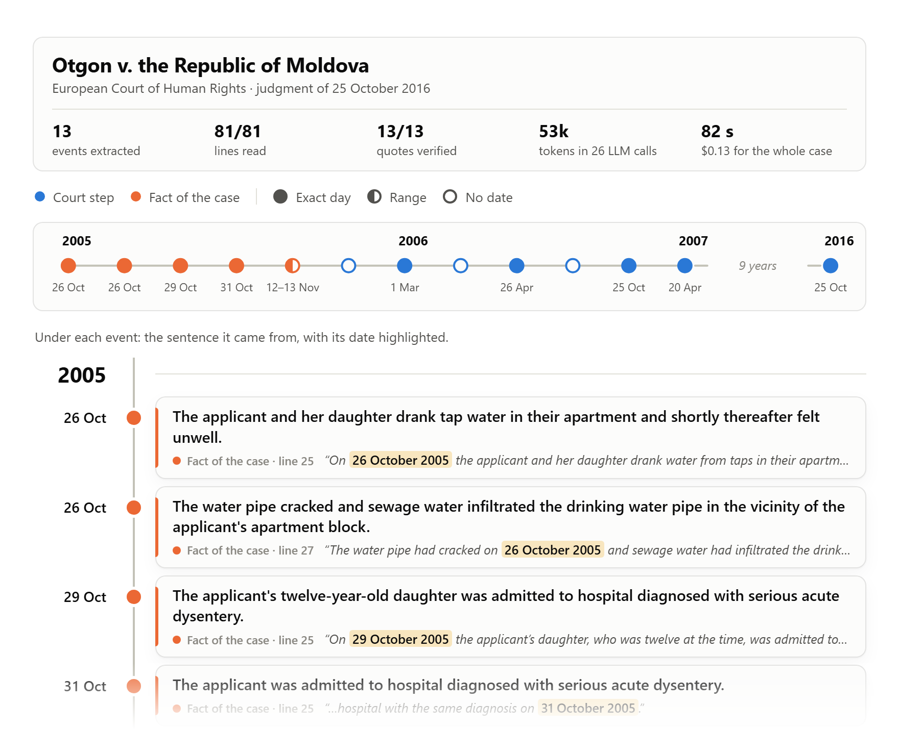
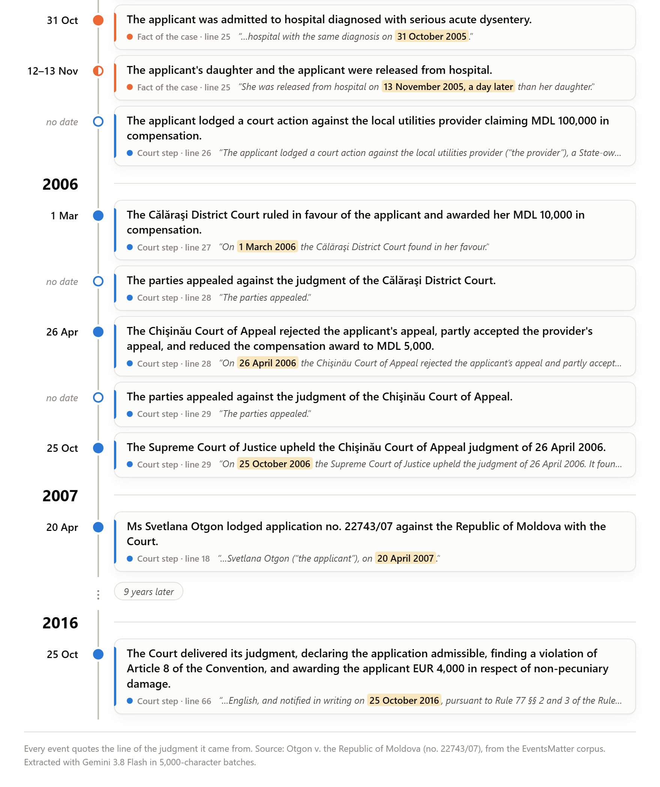
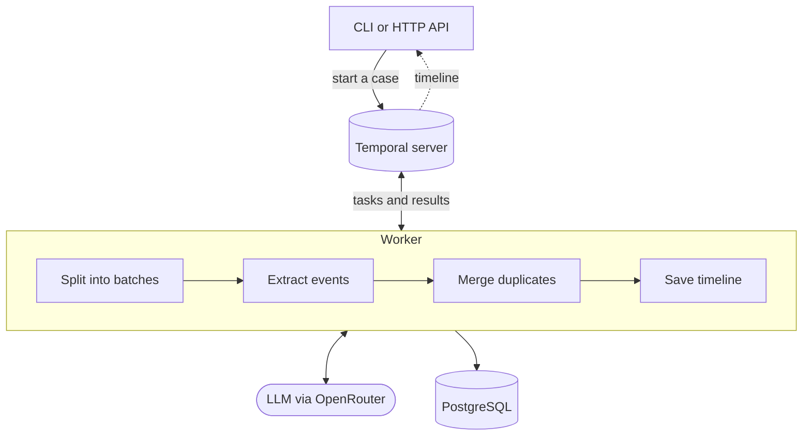
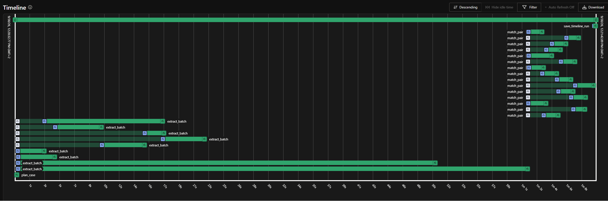
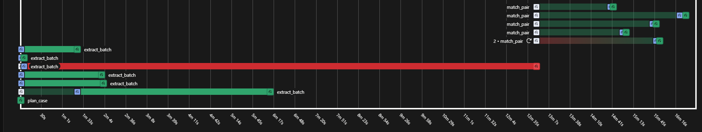

# Evidence Timeline Engine

[](https://github.com/krmaschek/EvidenceTimelineEngine/actions/workflows/tests.yml)

A backend service that turns documents into a timeline you can check, with every event linked to
the sentence it came from. It works with court decisions, medical records and any other text that
describes events over time.

<picture>
  <source media="(prefers-color-scheme: dark)" srcset="docs/timeline-hero-dark.png">
  
</picture>

*An example from the evaluation dataset: Otgon v. the Republic of Moldova. The engine returns JSON;
this page is drawn from that output.*

<details>
<summary><b>See the other 10 events</b></summary>

<picture>
  <source media="(prefers-color-scheme: dark)" srcset="docs/timeline-rest-dark.png">
  
</picture>

</details>
<br>

You start a case through the HTTP API or the CLI. A worker reads every line with an LLM, checks
that the sentence behind each event is really in the document, and flags unclear dates for review.
The timeline comes back as JSON and is saved to PostgreSQL. Each case runs as a [Temporal](https://temporal.io)
workflow, so a crash or a failed call doesn't lose the work already done. What counts as an event is
set in two small files per dataset, so other kinds of documents need no code changes.

Tested on 15 court decisions that weren't used during development:

| 94.3% precision | 84.9% recall | 15/15 cases finished | ~1 min and $0.14 per case |
|:---:|:---:|:---:|:---:|

<sub>The decisions are judgments of the European Court of Human Rights, with events marked by legal
experts.</sub>

Built with Python, Temporal, PostgreSQL, FastAPI and Pydantic, using LLMs through OpenRouter.

[How it works](#how-it-works) · [Handling failures](#handling-failures) · [Results](#results) · [Try it](#try-it)

## Problems it solves

Asking an LLM for a timeline sounds simple. With long documents, several things go wrong:

| Problem | What the engine does |
|---|---|
| Given a whole long document at once, the model misses more events. | The documents are split into batches of up to 5,000 characters, and a check makes sure every line goes to the model exactly once. In the tests, batches found 4 to 6 points more events than whole documents, with all three models. |
| The model can make things up. | Each event has to quote its source with line numbers, and the quote is checked against those lines, so a person can verify any event quickly. In the 15 test cases, 283 of 284 quotes were found exactly where the model said. |
| Dates are often relative or vague ("a day later", "late 2005"), and documents can disagree. | Each date is stored with its precision: an exact day, a range, conflicting dates or no date. Anything less than an exact day is flagged for review, and when records give different days, all of them are kept. |
| The same event is mentioned in several places. | Simple rules pick pairs that might be the same event, and the LLM decides for each pair. If it isn't sure, they stay separate. |
| Batching means many LLM calls per case: 12 to 72 in the tests. Any of them can time out or hit a rate limit, and the process can crash. | Each case runs as a Temporal workflow. Every call is retried on its own, and finished work survives a crash, so a failure only costs that one call. |
| A case can take several minutes, too long to keep an HTTP request open. | The API starts a job and answers right away with a job id. The client asks for progress and gets the timeline when it's ready. |

## How it works



1. **Plan.** The documents are split into batches of up to 5,000 characters, and a line is never
   split. The plan also loads the dataset's definition of an event: its event types and what to
   extract.
2. **Extract.** Each batch goes to the LLM, and the answer has to follow a JSON schema: what
   happened, when, and the quote with its line numbers. Every quote is then checked against the
   lines it cites. All batches start together, but only four run at a time.
3. **Merge.** Records of the same event are combined into one event that keeps all their quotes.
   The LLM's answer for each pair is saved with its reason, so you can see why two records were
   merged.
4. **Save.** The events are sorted by date. The run comes back as JSON and is saved to PostgreSQL in
   one transaction.

The `extract` command runs the same steps in a single process, without Temporal, which is handy for
trying things out.



*One case in Temporal's web UI. All nine batches start together, but only four run at a time. The
darker part of each bar is time spent waiting for a slot. After that come the same-event questions
and the save.*

<details>
<summary><b>What one event looks like</b></summary>

```json
{
  "description": "The applicant's daughter and the applicant were released from hospital.",
  "event_type": "circumstance",
  "date_precision": "approximate",
  "date_earliest": "2005-11-12",
  "date_latest": "2005-11-13",
  "evidence": [
    {
      "line_start": 25,
      "line_end": 25,
      "quote": "She was released from hospital on 13 November 2005, a day later than her daughter.",
      "date_text": "13 November 2005, a day later"
    }
  ],
  "citation_errors": [],
  "needs_review": true,
  "review_reasons": ["approximate date"]
}
```

The sentence gives two release dates, so the model stored a range instead of picking one, and the
event is marked for review. Shortened from the Otgon run.

</details>

## Handling failures

In the evaluation runs, 122 of 6,417 LLM calls needed a retry, mostly because of rate limits. All
but 8 of them got through.

- Temporal retries a failed call, up to 5 tries with longer waits in between. Errors a retry can't
  fix, like a wrong API key, fail right away.
- A batch that still fails is saved with its error. The rest of the case finishes, and the run is
  marked `partial`.
- If the worker crashes, the case continues where it stopped. Finished calls aren't sent to the LLM
  again.
- The save is idempotent. If the worker crashes just after saving, Temporal runs the save again. The
  second save has the same ids as the first, so the database still holds one copy.
- The API reads job status from Temporal, so there's no jobs table to get out of sync.



*A real failure from the model comparison. One batch (red) hit the model's output limit, so it
wasn't retried. One match_pair call (marked 2) hit a rate limit and went through on its second try.
The rest of the case still finished.*

## Results

The engine was tested on [EventsMatter](https://zenodo.org/records/4032617), a public dataset of 30
judgments of the European Court of Human Rights, with 615 events marked by two legal experts. Half
of the judgments were used during development. The other 15 were run only once, at the end, with
the code frozen.

On those 15 judgments the engine found **84.9%** of the experts' events (recall), and **94.3%** of
the events it reported matched one of theirs (precision). A case took about a minute and cost $0.14.

With only 15 cases, the numbers could be a few points higher or lower on other court decisions. An
LLM judge decided which events matched, and a sample was checked by hand.

The setup was chosen on the development judgments. Three models were compared, each with
5,000-character batches and with the whole document at once. The setups failed on 3 different cases
between them, so all columns except Finished use the other 12, the same for every setup.

| Setup | Finished | Precision | Recall | Cost per case | Time per case |
|---|:---:|:---:|:---:|:---:|:---:|
| **Gemini 3.8 Flash, 5,000 chars** | **15/15** | **91.9%** | **83.4%** | **$0.15** | **1.0 min** |
| Gemini 3.8 Flash, whole document | 15/15 | 95.0% | 78.8% | $0.06 | 0.6 min |
| DeepSeek V4 Pro, 5,000 chars | 13/15 | 86.0% | 88.0% | $0.18 | 6.9 min |
| DeepSeek V4 Pro, whole document | 13/15 | 92.0% | 84.3% | $0.12 | 5.1 min |
| Qwen 3.8 Flash, 5,000 chars | 13/15 | 61.4% | 82.0% | $0.08 | 14.4 min |
| Qwen 3.8 Flash, whole document | 14/15 | 88.2% | 76.0% | $0.02 | 7.4 min |

<sub>Why some runs didn't finish: on two cases, the host cut off DeepSeek's and Qwen's answers
whenever a quote described a sexual offence. On a third, one Qwen batch hit the output limit, the red
bar under Handling failures.</sub>

Recall matters most here, because a missing event is worse than an extra one. Of the setups that
finished every case, Gemini with 5,000-character batches found the most events, so it was chosen.
DeepSeek found more, but it didn't fully finish two cases and was 5 to 7 times slower.

Other findings:
- With all three models, 5,000-character batches had 4 to 6 points higher recall than whole
  documents. Whole documents are cheaper, so they're an option when cost matters more.
- A second pass that asked the model what it missed found none of the missing events and cost 32%
  more, so it was dropped.

The scripts that ran the evaluation are in [evals/](evals/).

## Try it

The repository includes three small example cases of fictional medical records, in
[datasets/clinical_v1/inputs/](datasets/clinical_v1/inputs/). The steps below run
case B: five short records that mention some events more than once. The LLM is Gemini 3.8 Flash
through OpenRouter, the model the evaluation picked.

You need Python 3.12 or newer, [uv](https://docs.astral.sh/uv/), Docker and an
[OpenRouter](https://openrouter.ai) API key. A run costs a few cents.

1. Install and add your key:
   ```bash
   uv sync
   cp .env.example .env    # then put your OpenRouter key in LLM_API_KEY
   ```
2. Start PostgreSQL and Temporal:
   ```bash
   docker compose up -d
   ```
3. Start the worker and the API, each in its own terminal:
   ```bash
   uv run --env-file .env evidence-timeline worker --extractor llm
   uv run uvicorn evidence_timeline.api:app
   ```
4. Start a case, then check on it:
   ```bash
   # start case B; the answer is a job id, like {"job_id": "timeline-case_B-e92ce4de"}
   curl -X POST http://localhost:8000/jobs -H "Content-Type: application/json" \
        -d '{"case_dir": "datasets/clinical_v1/inputs/case_B", "max_chars": 500}'

   # with your job id: the progress, and the timeline once it's done
   curl http://localhost:8000/jobs/timeline-case_B-e92ce4de
   curl http://localhost:8000/jobs/timeline-case_B-e92ce4de/timeline
   ```

The small `max_chars` splits this short case into several batches, so you can watch them in
Temporal's UI at http://localhost:8233. Try stopping the worker with Ctrl+C while they run and
starting it again: the batches that already finished aren't sent to the LLM again.

To run your own documents, make a dataset folder like the ones in [datasets/](datasets/):

```
my_dataset/
  domain.json      the event types the model may use
  scope.md         which events to extract and which to leave out, in plain words
  inputs/
    case_1/        one folder per case, with one or more .md documents
```

Then start a job with `"case_dir": "my_dataset/inputs/case_1"`. No code changes are needed.

## Reference

<details>
<summary><b>Design decisions</b></summary>

- Every line goes to the model. There's no retrieval step that picks the relevant parts first,
  because the goal is a complete timeline, and a search could skip the one sentence that matters.
- Document text is treated as data. The lines are sent as JSON strings, and the prompt tells the
  model never to follow instructions found in them. This lowers the risk of prompt injection, but
  doesn't remove it.
- The model's answer has to match a JSON schema generated from the Pydantic models. Pydantic also
  checks the date rules, for example that an exact date has one day and an approximate date only a
  range. If one event breaks them, only its dates are cleared and it's flagged for review, so the
  rest of the answer is kept.
- There's no confidence score. Uncertainty shows in things a person can check: the date's precision
  and the review reasons.
- When the LLM isn't sure whether two records are the same event, they stay separate. A duplicate is
  easy to spot in the timeline, but a wrong merge would create an event that never happened.
- Temporal only orchestrates. The steps are the same functions the `extract` command uses, run as
  Temporal activities: reading the files, calling the LLM and saving.
- The workflow code is deterministic. After a crash, Temporal rebuilds the workflow by running its
  code again against the saved history, so it has to make the same decisions every time. It does no
  I/O, and it takes the run id and the time from Temporal, so the rebuilt run gets the same id.
- There's one retry mechanism. In the worker, the extractor's own retry loop is switched off and
  Temporal does the retrying. It waits 15, 30, 60 and 120 seconds between tries, because a rate
  limit can last minutes.
- Each quote is its own row in PostgreSQL, so "which events cite document A02?" is a plain SQL
  query.

</details>

<details>
<summary><b>Limitations</b></summary>

- The quote check only confirms where a sentence is. It doesn't prove that the sentence supports
  the event, its date or its status. That still needs a person.
- The evaluation used only court decisions. The only other test was on three small fictional medical
  cases, so the quality on other real documents is unknown.
- A long document is cut into batches that don't overlap. An event described across a cut can be
  missed.
- The host can refuse some content. In the model comparison, one host stopped answering in the middle
  of quotes about sexual offences, so the whole batch failed every time. Retrying gives the same result.
  Another host can be pinned with `LLM_PROVIDER`.
- Apart from broken dates, one invalid event, such as one without a quote, makes the whole answer
  invalid. The batch is retried with the same request, without telling the model what was wrong, so
  the same mistake can happen again.
- Records of one event that are more than 3 days apart are never compared, so they stay separate. An
  event without a date is compared with every event of its type, which can mean hundreds of LLM
  questions on a large case: up to 674 on one case in the model comparison.
- The API has no authentication, and documents can't be uploaded: a job points to a folder the
  worker can read. Job status also needs a running worker, because Temporal asks the worker for it.
- The document text is sent to an external LLM provider and stored in Temporal's history. Court
  decisions are public, but real case files would need more safeguards.

</details>

<details>
<summary><b>How the evaluation was done</b></summary>

Three scripts in [evals/](evals/) run the evaluation:

1. `run_study.py` runs every case, model and batch size listed in a study file through Temporal,
   and saves each run with its history. It can be restarted after a crash and stops at a spending
   limit.
2. `draft_reviews.py` drafts a match for every predicted event from the lines it cites. An
   LLM-as-a-judge then checked every draft and corrected the wrong ones. As a sanity check, someone
   who isn't a lawyer also checked 20 uncertain ones by hand, without seeing the judge's answers.
3. `build_table.py` computes precision, recall, cost, time and output tokens per case.

The answer keys never reach the model, and a test checks that the extraction code doesn't import
the evaluator.

How sure the numbers are:
- Resampling the 15 final cases (bootstrap) gives a 95% range of 79–91% for recall and 88–98% for
  precision.
- An earlier run of the same setup on the same 12 development cases differed by up to 1.4 points,
  so smaller gaps between setups are noise.
- Runs that failed only because of rate limits were run again. All other failures were kept as real
  results.

</details>

## Credits

The court decisions (© ECHR-CEDH) and expert annotations are from the
[EventsMatter corpus](https://zenodo.org/records/4032617) by Filtz et al. (JURIX 2020). It isn't
included here. [converters/eventsmatter/](converters/eventsmatter/) downloads it.
